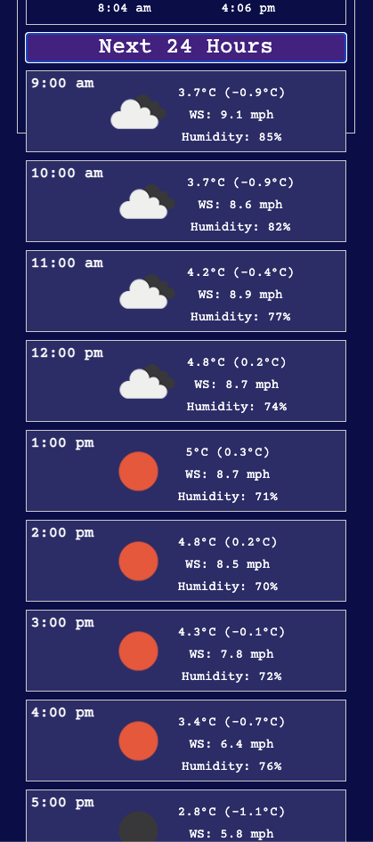

# Project X: On-StartUp Admin Page


## Overview 
The idea with this project is to create an admin page that I can launch when opening a browser or turning on my computer and have everything I want to catch up on in one place rather than having to jump around. This is an ongoing project for which I am using React.

## Technologies

* React
* HTML
* CSS/SCSS
* Webpack
* Node.js

## Approach 

I havent taken any strict approach with this project and have instead started with technologies that I came across at the time and made notes of others to add as I came across them. 

### Time & Date 
I wanted a ticking clock that would show the up to date time in whatever timezone was inputed. This was very straightforward to implement using the react-libe-clock library. I already had the date from the API I was using for the weather so I used Moment to convert it back from a UNIX timestamp. The reason I chose to display this date, was that I knew I would want to use the future weather information that the API provides and therefore it seemed right to start as I meant to continue.

```
 <Clock format={'HH:mm:ss'} ticking={true} timezone={props.weatherInfo.timezone} />
 <h3>{moment.unix(props.weatherInfo.current.dt).format('Do MMMM YYYY')}</h3>
```

### Current Weather
I wanted a quick snapshot of the weather at my location on startup but I also wanted to be able to search for a location and get the same back. I wanted something that could be understood at a glance but have a bit more detail if required. It seemed natural to me to have the temperature and the weather icon stand out. The icons werent as staright forward as I would have liked, they werent presented as well as I would have liked by the API. I decided to spend a bit of time hard-coding these to avoid issues in getting them, however this presented it's own problems. For each icon there is a 'day' and 'night' version and therefore the time of sunset needs to be checked before displaying in order to get the right one.

```
if (props.weatherInfo.current.dt > props.weatherInfo.current.sunset) {
  src = iconMapping[props.weatherInfo.current.weather[0].description][1]
} else {
  src = iconMapping[props.weatherInfo.current.weather[0].description][0]
}
```

### Future Weather
Simply having the current weather displayed when there was so much more information available from the API seemed futile. I decided to display the next 24h and the next 7 days. However having these constantly on display would be annoying as it would take up too much space. I wanted to be able to show/hide these with a button. For this I used a piece of state for each passed down to the components as props.

```
<button className="show-hide" id="show-hide-1" onClick={() => {
    setShowHideTF(!showHideTF)
}}>Next 24 Hours</button>
<NextTF weatherInfo={weatherInfo} showHideTF={showHideTF} />
<button className="show-hide" id="show-hide-2" onClick={() => {
    setShowHideFD(!showHideFD)
}}>Next 7 Days</button>
<FutureDays weatherInfo={weatherInfo} showHideFD={showHideFD} />
```

### League Table
I wanted a quick snap shot of the league table and of my teams current position. For this I used a football data API. When I implemented this I had not learnt how to put together a backend yet so I used a CORS proxy to ping it. I used Bulma to style the table with a function to highlight my team, show the champions league/europa and relegation zones.

```
  function buildClasses(team, index) {
    const spurs = team.team.name
    if (spurs === 'Tottenham Hotspur FC' && index === 3 || spurs === 'Tottenham Hotspur FC' && index === 4 || spurs === 'Tottenham Hotspur FC' && index === 16) {
      return 'is-selected bottom-border'
    } else if (spurs === 'Tottenham Hotspur FC') {
      return 'is-selected'
    } else if (index === 3 || index === 4 || index === 16) {
      return 'bottom-border'
    }
  }
```

## Screenshots


  
   


## KnownBugs
* ***Bulma*** - Having built the date/time/weather feature before doing the league table, once bulma was in place it slightly shifted the formatting I had in place. This should be a quick fix, but I have yet to address it.


## Future Features

* ***Show/Hide Columns on League Table*** - The table currently takes up quite a lot of space and isn't the 'snapshot' that I wanted. I will be putting in place a similar show/hide button that the weather currently has for most of the columns.

* ***Scores/Fixtures*** - I want to be able to see both the upcoming fixture and the most recent scores. Given the way the API returns information I will start by implementing this for the Premier League and then move onto other competitions.

* ***ToDo List*** - I want to put in a simple ToDo checklist.

* ***Email/Instant Message Window*** - Given that I want this to be an admin page I would like a way to be able to check messages quickly also. In an ideal world I would be able to reply to them from here also, but being able to see them would be a good starting point.

* ***Healines*** - I would like to display a qucik snapshot of both News and Sport headlines.
